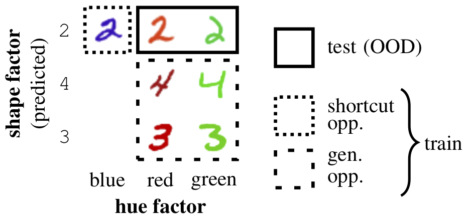

## DiagViB-6: A Diagnostic Benchmark Suite for Vision Models in the Presence of Shortcut and Generalization Opportunities

Common deep neural networks (DNNs) for image classification have been shown to rely on shortcut opportunities (SO) in the form of predictive and easy-to-represent visual factors. This is known as shortcut learning and leads to impaired generalization. In this work, we show that common DNNs also suffer from shortcut learning when predicting only basic visual object factors of variation (FoV) such as shape, color, or texture. Here, we introduce the Diagnostic Vision Benchmark suite *DiagViB-6*, which includes datasets and metrics to study a network’s shortcut vulnerability and generalization capability for six independent FoV. In particular, *DiagViB-6* allows controlling the type and degree of SO and GO in a dataset.



For more information about this work, please read our [ICCV 2021 paper](https://arxiv.org/abs/2108.05779):

> Eulig, E., Saranrittichai, P., Mummadi, C., Rambach, K., Beluch, W., Shi, X., & Fischer, V. (2021). DiagViB-6: A Diagnostic Benchmark Suite for Vision Models in the Presence of Shortcut and Generalization Opportunities. In Proceedings of the IEEE/CVF International Conference on Computer Vision (ICCV).

### Questions and Reference
Please contact [Elias Eulig](mailto:elias@eeulig.com?subject=[GitHub]%20DiagViB-6)
or [Volker Fischer](mailto:volker.fischer@de.bosch.com?subject=[GitHub]%20DiagViB-6) with
any questions about our work and reference it, if it benefits your research:
```
@InProceedings{diagvib_iccv2021,
author = {Eulig, Elias and Saranrittichai, Piyapat and Mummadi, Chaithanya Kumar and Rambach, Kilian and Beluch, William and Shi, Xiahan and Fischer, Volker},
title = {DiagViB-6: A Diagnostic Benchmark Suite for Vision Models in the Presence of Shortcut and Generalization Opportunities},
booktitle = {Proceedings of the IEEE/CVF International Conference on Computer Vision (ICCV)},
month = {October},
year = {2021}
}
```
